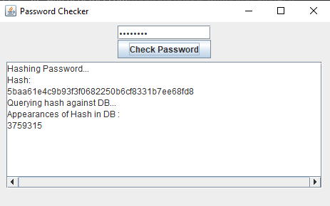

# password-checking-tool
Check if your passwords have been exposed in data breaches

Use this tool to check if your passwords are included in any data breaches, and if they are, how many times they occur.

The tool generates a SHA1 hash of your password locally and queries pwnedpassword.com's API using the first 5 characters of the hash.

